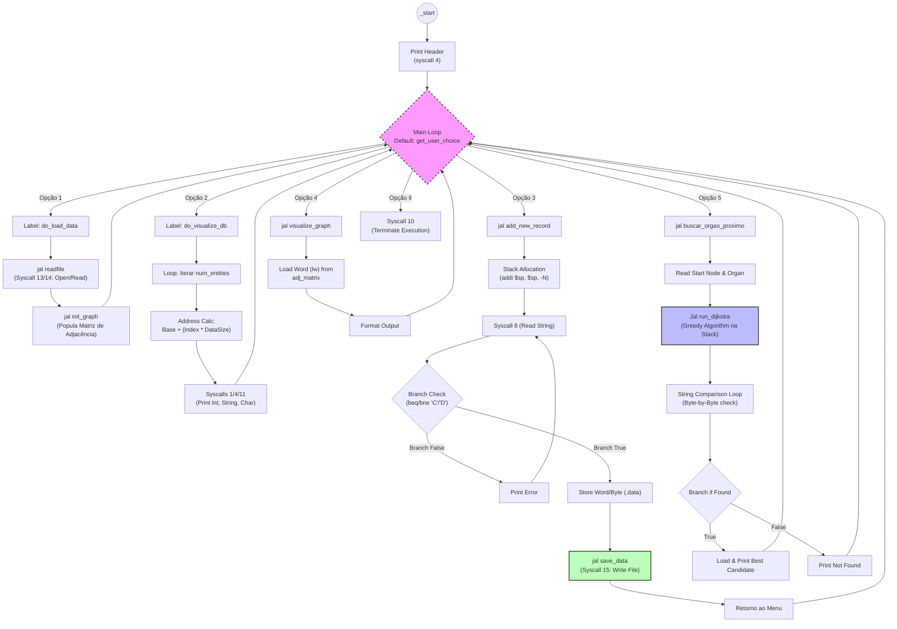

# OPO Search System

## Visão Geral
O OPO Search System é uma aplicação desenvolvida em Assembly MIPS projetada para simular o processo de coordenação de doação de órgãos gerenciado por Organizações de Procura de Órgãos (OPOs). O sistema modela a relação entre doadores e centros de distribuição utilizando estruturas de grafos, auxiliando na identificação do órgão disponível mais próximo para uma determinada solicitação.

## Contexto do Projeto
Este projeto foi inspirado pelo desempenho da OPO na região noroeste de São Paulo, Brasil — líder nacional em taxas de doação de órgãos. O sistema visa apoiar esse processo automatizando a busca e o correspondência de órgãos entre potenciais doadores e hospitais ou centros de distribuição.

## Funcionalidades
- Representação de grafos utilizando matriz de adjacência em Assembly.
- Armazenamento de dados de doadores e centros de distribuição.
- Algoritmo de busca de órgãos para encontrar a correspondência disponível mais próxima.
- Interface de usuário baseada em texto para interação.
- Exibição da disponibilidade de órgãos e resultados de correspondência.

## Equipe
- **Daniel Monteiro Ribeiro**
- **Davi de Souza Santos**
- **João Vitor Moreira Gomes**
- **Thiago Sole Gomes Heleno**

## Período de Desenvolvimento
**Início:** 27 de Outubro de 2025
**Entrega:** 09 de Dezembro de 2025

## Módulos
- **`main.asm`**: Ponto de entrada da aplicação, gerenciando o loop principal e o fluxo lógico de alto nível.
- **`ui.asm`**: Gerencia toda a interação com o usuário, incluindo menus, prompts de entrada e visualização de dados.
- **`readfile.asm`**: Responsável por interpretar o arquivo `dados.txt` e carregar entidades e arestas na memória.
- **`writefile.asm`**: Gerencia a persistência reescrevendo o arquivo `dados.txt` com os dados atualizados da memória.
- **`add_record.asm`**: Gerencia a lógica para coletar a entrada do usuário para criar novos Doadores ou Centros.
- **`search.asm`**: Implementa o algoritmo de busca de órgãos utilizando Dijkstra para encontrar o doador compatível mais próximo.
- **`graph.asm`**: Define as estruturas de dados do grafo (matriz de adjacência) e rotinas de inicialização.

## Tecnologias
- **Assembly (MIPS)** — Implementação da lógica central e estruturas de dados.
- **Terminal (interface texto)** — Interação com o usuário.

## Licença
Este projeto foi desenvolvido para fins acadêmicos como parte da disciplina de *Arquitetura e Organização de Computadores* (AOC).

---

# Relatório Técnico do Sistema: Organ-Finder

Este documento apresenta a especificação técnica e o fluxo de execução do **Organ-Finder**, detalhando sua implementação em **Assembly MIPS**. O foco é a análise da arquitetura do software, manipulação de memória e interação com o sistema operacional via *system calls*.

## Fluxo de Controle e Dados

O diagrama abaixo ilustra o fluxo de execução (*Control Flow*) do programa, evidenciando as chamadas de procedimento (`jal`) e a lógica de decisão.

## Detalhamento da Implementação (Nível de Arquitetura)

### 1. Fluxo Principal e Controle (`main.asm`)
O ponto de entrada (*entry point*) da aplicação. Coordena a execução chamando sub-rotinas e gerenciando o loop principal.

*   **Entry Point (`_start`):** Configura o ambiente inicial e desvia para `main`.
*   **Dispatch Table (Simulada):** O loop principal lê a escolha do usuário e utiliza uma sequência de *branches* (`beq`) para desviar o fluxo para o *label* correspondente (ex: `do_load_data`, `do_search`), funcionando como um *Switch-Case* primitivo.

### 2. Carregamento e Parsing de Dados (`readfile.asm`)
A persistência de dados é tratada diretamente via *System Calls* do kernel simulado pelo MARS.

*   **File I/O:** Utiliza `$v0 = 13` (Open) para obter o *File Descriptor* e `$v0 = 14` (Read) para carregar o fluxo de bytes em um buffer contíguo na seção `.data`.
*   **Parsing Manual:** O processador percorre o buffer byte a byte (`lb`), comparando-os com delimitadores ASCII (`;` e `\n`) para segmentar os campos.
*   **Conversão ASCII-to-Integer:** Implementa uma rotina (`atoi`) que converte sequências de caracteres numéricos (base 10) para inteiros binários de 32 bits, armazenados em *arrays* alinhados (`.align 2`).

### 3. Manipulação de Memória e Endereçamento (`ui.asm`)
A visualização tabular demonstra aritmética de ponteiros explícita.

*   **Endereçamento Indexado:** Para acessar a entidade `i`, o programa calcula o *offset* de memória.
    *   Exemplo para Inteiros (ID): `Endereço = Base + (i * 4)` (Deslocamento lógico `sll $t0, $s0, 2`).
    *   Exemplo para Strings (Nome, 64 bytes): `Endereço = Base + (i * 64)` (`sll $t0, $s0, 6`).
*   **Syscalls de Saída:** Utiliza `$v0 = 1` para inteiros, `$v0 = 4` para strings null-terminated e `$v0 = 11` para caracteres individuais.

### 4. Entrada de Dados e Gerenciamento de Pilha (`add_record.asm`)
Este módulo evidencia o controle do fluxo e o uso da pilha (*Stack*) para variáveis locais.

*   **Validação de Input (Branching):** Utiliza instruções de desvio condicional (`beq`, `bne`) para criar loops de validação. O caractere lido é comparado com os imediatos 'C' e 'D'.
*   **Stack Pointer (`$sp`):** O ponteiro de pilha é decrementado (`addi $sp, $sp, -4`) para alocar buffers temporários para leitura de strings, garantindo que não haja corrupção de registradores salvos (`$ra`, `$s0`-$`s7`).
*   **Interrupção de Fluxo:** Se a capacidade máxima (50 entidades) for atingida, um *branch* desvia a execução para evitar *Buffer Overflow* na seção de dados estáticos.

### 5. Persistência de Dados (`writefile.asm`)
Responsável por serializar o estado da memória de volta para o disco.

*   **Conversão Integer-to-ASCII (`itoa`):** O processo inverso do carregamento. O programa divide o inteiro sucessivamente por 10 (`div`), armazena o resto (`mfhi`) na pilha e reconstrói a string ASCII.
*   **System Call Write:** Utiliza `$v0 = 13` com *flags* de escrita e truncamento, seguido de múltiplas chamadas `$v0 = 15` para escrever os buffers sequencialmente.

### 6. Algoritmos e Estruturas de Dados (`graph.asm` & `search.asm`)
O núcleo computacional do sistema.

*   **Matriz de Adjacência:** O grafo é mapeado em uma região linear de memória, simulando uma matriz 2D. O acesso ao peso da aresta `(u, v)` é feito pela fórmula:
    > `Endereço = Base_Matriz + [(u * MAX_NOS + v) * 4]`
*   **Algoritmo de Dijkstra:** Implementado de forma gulosa (*greedy*) para encontrar caminhos mínimos.
    *   **Registradores:** Uso intensivo de registradores `$s` para manter estado persistente (distâncias, vetor de visitados) através de chamadas de função.
    *   **Análise de Strings:** A busca por órgãos executa uma comparação byte a byte (*String Matching*) entre a entrada do usuário e o campo de órgãos armazenado, ignorando *case* (manipulação de bits ASCII, ex: `or $t0, $t0, 0x20` para *to_lower*).